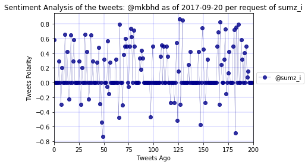

```python
#Build a Twitter bot that sends out visualized sentiment analysis of a Twitter account's recent tweets.

#import dependencies
import pandas as pd
import numpy as np
import tweepy
import time
import datetime
import json
import random
import matplotlib.pyplot as plt

# Import and Initialize Sentiment Analyzer
from vaderSentiment.vaderSentiment import SentimentIntensityAnalyzer
analyzer = SentimentIntensityAnalyzer()
```


```python
word="analyze"

# Twitter API Credentials
consumer_key = "RQ5agXROjsxpclKe1y7VjAw5B"
consumer_secret ="shcfjOAaad2T5yiRIC5pf1Oi6AAdsx3aOiG19lHu4OdrLYHrOg"
access_token = "909584243730386946-s0G6QAyDZoTXHjaX2CYrEtyWzmh8MPY"
access_token_secret = "TI735IBEu8UrCK4NcnwvR47DufLvkuC2PKDLWlpJzQvpk"

# Use Tweepy to Authenticate our access
auth = tweepy.OAuthHandler(consumer_key, consumer_secret)
auth.set_access_token(access_token, access_token_secret)
api = tweepy.API(auth, parser=tweepy.parsers.JSONParser())


#get tweet mention from timeline
user=[]


while(True):
    # Variables for holding sentiments
    
    compound_list = []
    positive_list = []
    negative_list = []
    neutral_list = []

    mention_tweets = api.mentions_timeline()
    length=0

    for item in mention_tweets:

        text=item["text"]
        text=text.lower()
        requestor=item["user"]["screen_name"]
        if word in text:
            get_user=text.split("@")
            t_user=("@"+str(get_user[-1]))
            t_user=t_user.strip()
            if t_user not in user:
                
                user.append(t_user)

                for x in range(10):

                    public_tweets = api.user_timeline(t_user,page=x)

                    for tweet in public_tweets:

                        try:

                                # Run Vader Analysis on each tweet
                            compound = analyzer.polarity_scores(tweet["text"])["compound"]
                            pos = analyzer.polarity_scores(tweet["text"])["pos"]
                            neu = analyzer.polarity_scores(tweet["text"])["neu"]
                            neg = analyzer.polarity_scores(tweet["text"])["neg"]


                                # Add each value to the appropriate list
                            compound_list.append(compound)
                            positive_list.append(pos)
                            negative_list.append(neg)
                            neutral_list.append(neu) 
                            length+=1

                                    # Plot Time Between Twets

                        except:

                            print("Missing Value")

                t=datetime.date.today()   
                plt.title("Sentiment Analysis of the tweets: %s as of %s per request of %s" % (t_user,str(t),requestor))
                plt.ylabel("Tweets Polarity")
                plt.xlabel("Tweets Ago")
                plt.plot(range(length), compound_list, marker="o", linewidth=0.25, alpha=0.8, color="darkblue",label=("@"+requestor))
                plt.xlim(0, length)

            #increase the plot size
                plt.rcParams["figure.figsize"] = (6,4)
                ax = plt.gca()

                ax.grid(linestyle='-', linewidth='0.2', color='blue')
                ax.patch.set_alpha(0.1)

                plt.legend(loc='center left', bbox_to_anchor=(1, 0.5))

                plt.savefig('Analysis.png')
                plt.show()

                #update the analysis

                api.update_with_media("Analysis.png",status=("@"+requestor))
                
            else:
                print("Analysis done already for ",t_user)
                
    time.sleep(30)
    print("Restarting the next phase of anlysis")
    

```





    Analysis done already for  @afhaque


    Restarting the next phase of anlysis
    Analysis done already for  @mkbhd
    Analysis done already for  @dalailama
    Analysis done already for  @beingsalmankhan
    Analysis done already for  @shekharkapur
    Analysis done already for  @afhaque
    Analysis done already for  @afhaque
    Analysis done already for  @parineetichopra
    Analysis done already for  @the_realsrk
    Analysis done already for  @realdonaldtrump
    Analysis done already for  @iamsrk
    Analysis done already for  @rihanna
    Analysis done already for  @cnn
    Restarting the next phase of anlysis
    Analysis done already for  @mkbhd
    Analysis done already for  @dalailama
    Analysis done already for  @beingsalmankhan
    Analysis done already for  @shekharkapur
    Analysis done already for  @afhaque
    Analysis done already for  @afhaque
    Analysis done already for  @parineetichopra
    Analysis done already for  @the_realsrk
    Analysis done already for  @realdonaldtrump
    Analysis done already for  @iamsrk
    Analysis done already for  @rihanna
    Analysis done already for  @cnn
    Restarting the next phase of anlysis
    Analysis done already for  @mkbhd
    Analysis done already for  @dalailama
    Analysis done already for  @beingsalmankhan
    Analysis done already for  @shekharkapur
    Analysis done already for  @afhaque
    Analysis done already for  @afhaque
    Analysis done already for  @parineetichopra
    Analysis done already for  @the_realsrk
    Analysis done already for  @realdonaldtrump
    Analysis done already for  @iamsrk
    Analysis done already for  @rihanna
    Analysis done already for  @cnn
    Restarting the next phase of anlysis
    Analysis done already for  @mkbhd
    Analysis done already for  @dalailama
    Analysis done already for  @beingsalmankhan
    Analysis done already for  @shekharkapur
    Analysis done already for  @afhaque
    Analysis done already for  @afhaque
    Analysis done already for  @parineetichopra
    Analysis done already for  @the_realsrk
    Analysis done already for  @realdonaldtrump
    Analysis done already for  @iamsrk
    Analysis done already for  @rihanna
    Analysis done already for  @cnn
    Restarting the next phase of anlysis


    Analysis done already for  @mkbhd
    Analysis done already for  @dalailama
    Analysis done already for  @beingsalmankhan
    Analysis done already for  @shekharkapur
    Analysis done already for  @afhaque
    Analysis done already for  @afhaque
    Analysis done already for  @parineetichopra
    Analysis done already for  @the_realsrk
    Analysis done already for  @realdonaldtrump
    Analysis done already for  @iamsrk
    Analysis done already for  @rihanna
    Analysis done already for  @cnn
    Restarting the next phase of anlysis
    Analysis done already for  @bbc
    Analysis done already for  @mkbhd
    Analysis done already for  @dalailama
    Analysis done already for  @beingsalmankhan
    Analysis done already for  @shekharkapur
    Analysis done already for  @afhaque
    Analysis done already for  @afhaque
    Analysis done already for  @parineetichopra
    Analysis done already for  @the_realsrk
    Analysis done already for  @realdonaldtrump
    Analysis done already for  @iamsrk
    Analysis done already for  @rihanna
    Analysis done already for  @cnn


```python

```
